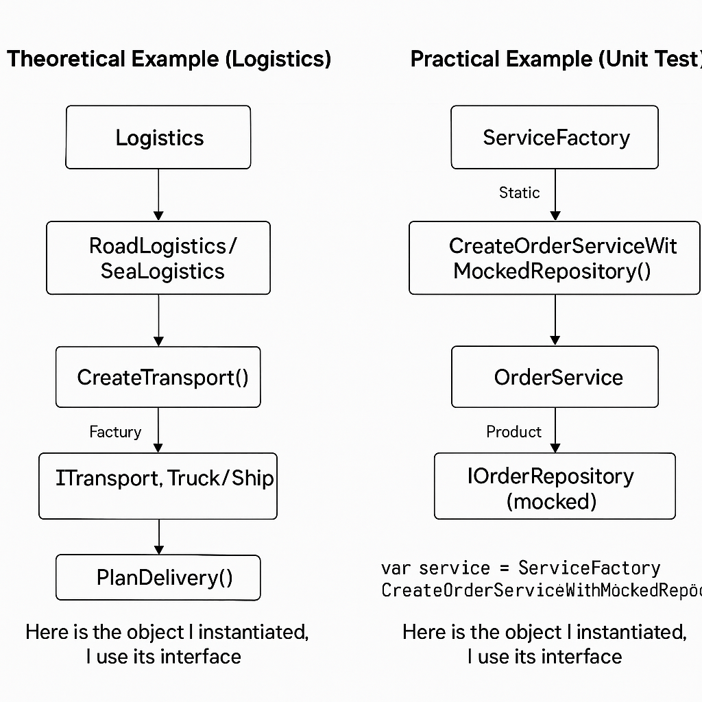

# Factory Method Pattern

## ✨ Overview

The Factory Method Pattern defines an interface for creating an object, but lets subclasses decide which class to instantiate. It promotes loose coupling by delegating object creation to subclasses.

## 🎯 Objective

Delegate the responsibility of creating objects to another class or method, instead of directly instantiating them using new in client code.

## 💡 When to Use

- When you don’t know in advance what types of objects your code will need.
- When you want to adhere to Open/Closed Principle.
- When you want to decouple object creation from its usage.

## 🛠 Example

This folder contains:

- `FactoryPatternExample` — The .NET code implementing the pattern.
- `FactoryPatternExampleTests` — Unit tests showing how to apply Factory in tests.
- 

## 📚 References

- [Official C# documentation](https://learn.microsoft.com/en-us/dotnet/standard/design-guidelines/)
- [Refactoring Guru - Factory Method](https://refactoring.guru/design-patterns/factory-method)
- [GoF Design Patterns](https://en.wikipedia.org/wiki/Design_Patterns)
## 🎥 Related Video

- [Factory Pattern Explanation](https://youtu.be/ZCLhDRkBaI0)
