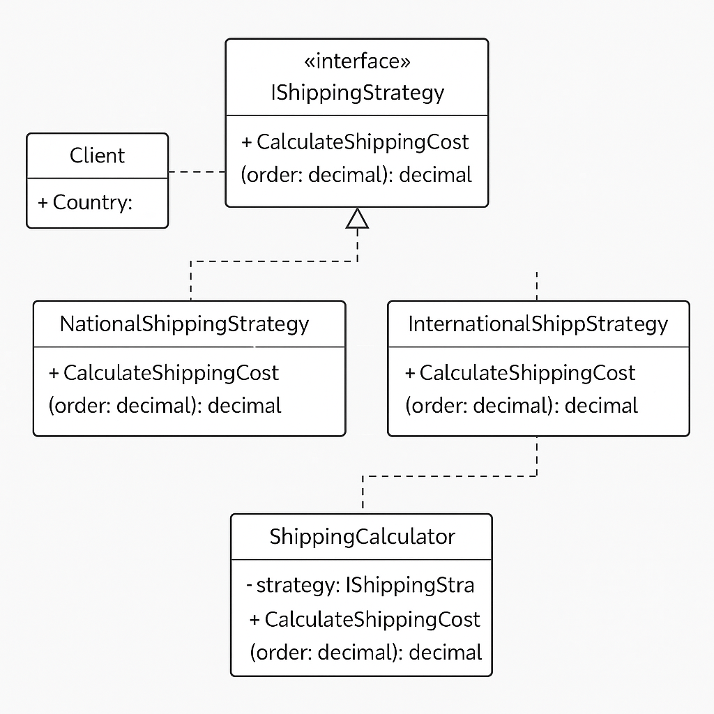

# Strategy Pattern

## 🎯 Objective

Delegate the responsibility of implementing a behavior or algorithm to separate classes, so that you can switch behavior at runtime without modifying the client code.

## 📌 Definition

The Strategy Pattern defines a family of algorithms, encapsulates each one, and makes them interchangeable. It allows the behavior to vary independently from clients that use it.

## 🧠 Analogy

Think of a navigation app: it can offer different route types (fastest, shortest, scenic). You choose the strategy, the app applies it.

## 🚀 When to Use

- You need to switch algorithms at runtime
- To eliminate large `if-else` or `switch` statements
- You want to follow Open/Closed Principle
- You need different behaviors for different clients

## 💡 Common Use Cases

- Tax/shipping/discount calculation
- Dynamic sorting logic
- Validation rules
- Data export (PDF, Excel, HTML)
- Game AI behavior

## 🛠 Example Structure

- `IOperationStrategy` – strategy interface
- `AdditionStrategy`, `SubtractionStrategy`, `MultiplicationStrategy` – concrete strategies
- `Calculator` – context that uses the strategy

## 📦 Real-World Scenario

In this project:
- `IShippingStrategy` defines the interface
- `NationalShippingStrategy`, `InternationalShippingStrategy`, `ExpressShippingStrategy` implement it
- `ShippingService` uses a strategy to calculate cost

## 📷 Diagram

- 

## 📚 References

- [Refactoring Guru](https://refactoring.guru/design-patterns/strategy)
- [Microsoft Docs](https://learn.microsoft.com/en-us/dotnet/standard/design-guidelines/)
- [GoF Design Patterns](https://en.wikipedia.org/wiki/Strategy_pattern)

## 🎥 Related Video
- [Strategy Pattern Explanation](https://youtu.be/Dd79dttdMKY)

## Blog
- https://wesleydevcamp.wordpress.com/2025/07/15/strategy-pattern/